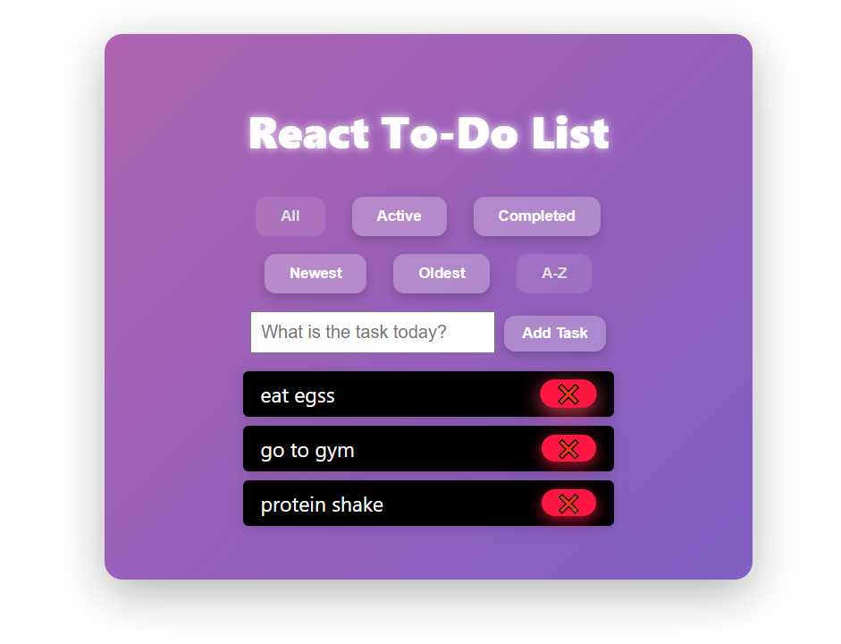

# React To-Do List App 📝

A fully functional and responsive React To-Do List application built as part of an internship project. This app supports adding, deleting, completing tasks, and includes sorting (newest, oldest, A-Z) and filtering (all, active, completed). Data is stored in local storage for persistence.

## 🔧 Features

- ✅ Add, complete, and delete tasks
- 🔍 Filter by All, Active, or Completed
- ↕️ Sort by Newest, Oldest, or Alphabetical
- 💾 LocalStorage persistence
- 📱 Responsive and clean UI with styled components

## 🚀 Technologies Used

- React.js (Functional Components + Hooks)
- HTML5 & CSS3
- JavaScript (ES6+)
- LocalStorage

## 📸 Preview



## 📂 Installation & Running Locally

```bash
git clone https://github.com/Samarth-Shekhar/Todo-List-app-React-js.git
cd Todo-List-app-React-js
npm install
npm start
📑 Folder Structure
css
Copy
Edit
src/
├── components/
│   ├── TodoForm.js
│   ├── TodoWrapper.js
│   ├── TodoWrapper.css
│   └── ...
├── App.js
├── App.css
└── index.js

##🤝 Contribution
This project was built for internship submission. Contributions are welcome for improvements.
